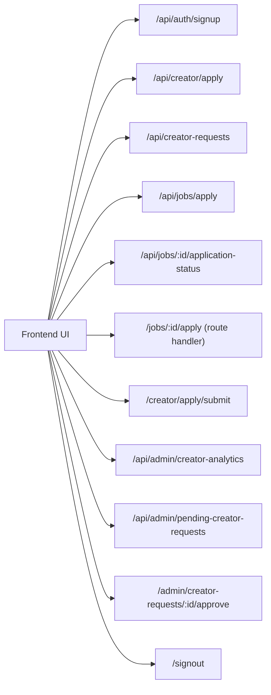

# HustleClub Full Website Wireframe

## 1) Full Sitemap + Role Flow

```mermaid
flowchart TD
  V[Visitor / Logged-out]
  U[Authenticated User]
  C[Creator]
  A[Admin]

  V --> H["Home /"]
  V --> L["Login /login"]
  V --> SU["Signup /signup"]
  V --> PUB1["Courses /courses"]
  V --> PUB2["Course Detail /courses/:id (public view)"]
  V --> PUB3["Jobs /jobs"]
  V --> PUB4["Job Detail /jobs/:id"]
  V --> PUB5["Marketplace /marketplace"]
  V --> PUB6["Marketplace Detail /marketplace/:id"]
  V --> PUB7["Public Profile /u/:username"]

  U --> P["Profile /profile"]
  U --> MYJ["My Applications /my-jobs"]
  U --> MYC["My Courses /my-courses"]
  U --> LEARN["Learn /learn/:id (enrolled only)"]
  U --> SELL["Sell /marketplace/sell"]
  U --> MYI["My Items /marketplace/my-items"]
  U --> EDI["Edit Item /marketplace/edit/:id"]
  U --> DELI["Delete Item /marketplace/delete/:id"]
  U --> ORD["Orders /marketplace/orders"]
  U --> BC["Become Creator /become-creator"]
  U --> CAP["Creator Apply /creator/apply"]

  C --> CD["Creator Dashboard /creator/dashboard"]
  C --> CAN["Creator Analytics /creator/analytics"]
  C --> CJN["Create Job /creator/jobs/new"]
  C --> CJM["Manage Job /creator/jobs/:id"]
  C --> CJA["Job Applications /creator/jobs/:id/applications"]
  C --> CC["Creator Courses /creator/courses"]
  C --> CCN["Create Course /creator/courses/new"]
  C --> CCM["Manage Course /creator/courses/:id"]
  C --> CCE["Edit Course /creator/courses/:id/edit"]
  C --> CM["Creator Marketplace /creator/marketplace"]
  C --> CMN["New Marketplace Item /creator/marketplace/new"]
  C --> CMM["Manage Item /creator/marketplace/:id"]
  C --> JLEG["Legacy Create Job /jobs/new (creator-only)"]

  A --> ADROOT["Admin Users /admin"]
  A --> ADAN["Admin Analytics /admin/analytics"]
  A --> ADCL["Admin Creator Analytics /admin/creator-analytics"]
  A --> ADCR["Creator Requests /admin/creator-requests"]
  A --> ADCO["Admin Courses /admin/courses"]
  A --> ADJ["Admin Jobs /admin/jobs"]
  A --> ADJN["Admin New Job /admin/jobs/new"]
  A --> ADJM["Admin My Jobs /admin/jobs/my-jobs"]
  A --> ADJA["Admin Applicants /admin/jobs/applicants"]
  A --> ADJAD["Admin Job Applicants /admin/jobs/:id/applicants"]
  A --> ADMP["Admin Marketplace /admin/marketplace"]
  A --> ADMPO["Admin Marketplace Orders /admin/marketplace/orders"]
  A --> ADUS["Admin Users Table /admin/users"]
  A --> ADAL["Audit Logs /admin/audit-logs"]
  A --> ADLI["Admin Listings /admin/listings"]
  A --> ADDASH["/admin/dashboard (redirects to /creator/dashboard)"]

  V --> U
  U --> C
  C --> A
```



## 2) App Shell Wireframe

```text
+----------------------------------------------------------------------------------+
| Navbar (global, sticky)                                                          |
| [HustleClub] [Courses] [Jobs] [Marketplace] [Role links] [Profile/Login/Signup] |
+----------------------------------------------------------------------------------+
| Page content (changes per route)                                                 |
| - Hero / cards / tables / forms / dashboards                                     |
+----------------------------------------------------------------------------------+
```

## 3) Key Screen Wireframes (Low-Fidelity)

### Home (`/`)

```text
+------------------------------------------------------+
| HERO                                                 |
| "Learn. Earn. Trade."                               |
| [Explore Jobs] [Browse Marketplace]                 |
+------------------------------------------------------+
| 3 Feature cards: Courses / Jobs / Marketplace       |
+------------------------------------------------------+
| Trust strip                                          |
+------------------------------------------------------+
```

### Listing Pages (`/courses`, `/jobs`, `/marketplace`)

```text
+------------------------------------------------------+
| Header + title + optional action button             |
+------------------------------------------------------+
| Grid/List of cards                                   |
| [Image] [Title] [Meta] [Action]                      |
| [Image] [Title] [Meta] [Action]                      |
+------------------------------------------------------+
| Empty state (if no records)                          |
+------------------------------------------------------+
```

### Detail Pages (`/courses/:id`, `/jobs/:id`, `/marketplace/:id`)

```text
+------------------------------------------------------+
| Main media / title / metadata                        |
+------------------------------------------------------+
| Description                                           |
+------------------------------------------------------+
| Contextual CTA                                        |
| - enroll / apply / buy / login to continue           |
+------------------------------------------------------+
```

### Creator Dashboard (`/creator/dashboard`)

```text
+------------------------------------------------------+
| Creator header + quick actions                       |
| [Post Job] [Manage Courses] [Manage Marketplace]     |
+------------------------------------------------------+
| Analytics cards (views, apps, conversion)            |
+------------------------------------------------------+
| Managed resources list (jobs/items/courses)          |
| [Manage] [View applications] [status chips]          |
+------------------------------------------------------+
```

### Admin Console (`/admin/*`)

```text
+------------------------------------------------------+
| Admin area (guarded by admin layout)                 |
+------------------------------------------------------+
| Analytics / users / creator requests / audit logs    |
| Tables + moderation actions + status updates         |
+------------------------------------------------------+
```

## 4) API Wireframe



## 5) Guard Summary

- Public: home, auth pages, browse pages, public profiles.
- User-only: profile, purchases/orders, enrolled learning, creator apply.
- Creator-only: all `/creator/*` and creator management workflows.
- Admin-only: all `/admin/*` via `app/admin/layout.tsx` + admin APIs.
- Note: `/admin/dashboard` currently redirects to `/creator/dashboard`.

